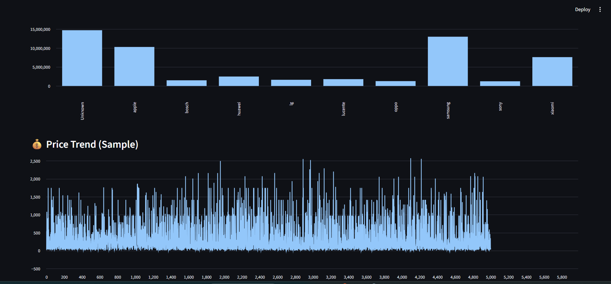

# E-commerce Funnel Analysis

## Overview

In this project, I analyzed a large e-commerce dataset (100M+ records) to understand user behavior and identify where users drop off in the purchase funnel.

The goal was to identify conversion issues and understand how user actions impact final purchases.

---

## What I Did

* Cleaned and processed a large-scale dataset using Python
* Used SQL (DuckDB) to analyze user interactions across funnel stages
* Built an interactive dashboard using Streamlit
* Calculated key metrics such as conversion rate and event distribution

---

## Key Findings

* Conversion rate is around **1.6%**, indicating low efficiency in the funnel
* Significant drop-off occurs between **product view and purchase**
* High user activity does not translate into proportional purchases

---

## Key Insights

* The majority of users exit before reaching the purchase stage
* Indicates potential issues in pricing, UX, or checkout process
* Highlights need for funnel optimization and retargeting strategies

---

## Business Impact

* Helps identify revenue leakage in the customer journey
* Supports data-driven decisions to improve conversion rates
* Useful for optimizing marketing and product strategies

---

## Tools Used

* Python (Pandas)
* DuckDB (SQL)
* Streamlit

---

## Dashboard Preview

---

## How to Run

pip install -r requirements.txt
python -m streamlit run dashboards/dashboard.py

---

## Author

Ravuri Vinay
